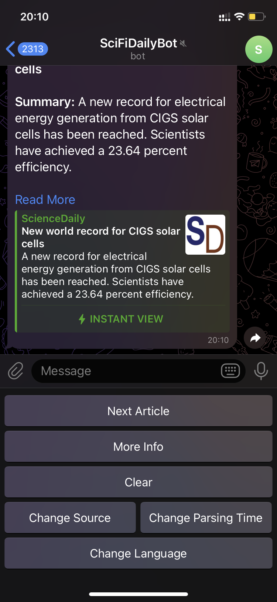

# Telegram News Bot

## 1. Introduction

This  project is focused on developing a Telegram Bot using the TelegramBot API. The primary function of this bot is to parse RSS feeds, beginning with ScienceDaily, and to notify users about new content at 30-minute intervals by default. Users are alerted to the number of unread news articles since the last update, with an accumulation feature for unviewed updates. The "read news" option presents a user-friendly menu of news titles and summaries, with navigational elements for an enhanced experience. The bot also allows users to clear the news feed, marking all unread news as read in a database.

## 2. Installation Instructions

### 2.1 Telegram Bot API Token

1. Create a new bot in Telegram using the `/newbot` command with @BotFather, and follow the prompts to receive an authentication token.
2. Ensure the bot's username ends with 'bot', e.g., 'newstodaybot'.
3. Securely store the generated token, as it's required to authorize your bot and send requests to the Bot API.

### 2.2 PostgreSQL Database Setup in Docker

1. Pull the Postgres Docker Image:
    ```
    docker pull postgres
    ```
2. Start a Postgres Instance in a Docker Container:
    ```
    docker run --name some-postgres -e POSTGRES_PASSWORD=mysecretpassword -d postgres
    ```

### 2.3 Configuration

Set up your configuration in `newsbot/src/main/resources/bot.properties` and `db.properties` respectively:

- bot.properties:
    ```
    telegram.token=YOUR TELEGRAM BOT TOKEN HERE
    ```
- db.properties:
    ```
    # Default db.url=jdbc:postgresql://localhost:5432/
    db.url=localhost
    # Default db.username=postgres
    db.username=YOUR DB USERNAME
    db.password=YOUR DB PASSWORD
    ```

### 2.4 Run the Application

Execute the following commands in the root project directory to run your application:

```
mvn compile
mvn exec:java
```

## 3. Usage Instructions

### 3.1 Starting the Bot

- Find your registered bot in @BotFather and start it using the `/start` command.

### 3.2 Registration Process

Upon starting the bot, you'll be guided through a registration process to:

1. Choose your preferred language.
2. Select your age category.
3. Set the parsing time interval for checking new articles.
4. Choose a news source from the available options.

### 3.3 Managing News Feed

- **Receiving Notifications**: Get alerts for new or unread articles.
- **Reading Articles**: Click "Read Articles" to view summaries.
- **Clearing News Feed**: Marks all articles as read.

### 3.4 Adjusting Settings

You can change:
- **Language**
- **News Source**
- **Parsing Time**

### 3.5 Navigating Articles

While reading:
- **Next Article Button**: Go to the next unread article.
- **More Info Button**: View the full article.

## 4. Upcoming Features

I am continuously working to enhance the capabilities of our Telegram News Bot. Here are some exciting features I have in the pipeline:

### 1. Multilingual Support
- **Status**: In Process
- **Overview**: My goal is to make bot accessible to users worldwide by introducing multilingual support. This will include adapting the bot’s interface for various languages and implementing a news translation feature. I am currently evaluating different approaches, such as using translation services or Language Learning Models (LLMs), to provide seamless news translation.

### 2. Universal News Website Compatibility
- **Status**: In Process
- **Overview**: I aim to broaden the bot's news sourcing capabilities beyond ScienceDaily to include virtually any news website. This enhancement will allow users to add their preferred news sources within specified categories, reducing the influx of irrelevant news content and tailoring the news feed to individual preferences. For this approach, the plan is to implement a classifier that can accurately distinguish news article text from other components of a website, such as navigation menus, advertisements, and user comments.

### 3. Advanced Text Summarization
- **Status**: Planned
- **Overview**: To ensure that users receive concise and relevant news summaries from a variety of sources, I plan to integrate an LLM for text summarization. This will involve selecting an LLM that is both efficient and capable of generating accurate summaries, optimizing the process to fit our bot’s framework.

### 4. Personalized Recommendation System
- **Status**: Planned
- **Overview**: I am exploring the development of a recommendation system that suggests news sources and articles based on individual user preferences and reading history. This feature aims to personalize the news-reading experience, making it more engaging and relevant to each user.


## 5. Screenshots

### Bot Interaction Screenshots

**Figure 1: Bot start**  


**Figure 2: Choose Language**  


**Figure 3: Choose age category**  


**Figure 4: Choose Parser work schedule**  


**Figure 5: Choose source (topic)**  


**Figure 6: Parsing process**  


**Figure 7: Fresh News message**  


**Figure 8: Read Articles**  


### News Manipulation and Article Navigation

**Figure 9: News manipulation menu**  


**Figure 10: Next Article**  


**Figure 11: More Info**  


**Figure 12: More Info (message splits if >4096 tokens)**  


### Settings and Configuration

**Figure 13: Clear News Feed**  


**Figure 14: Settings (Change Source)**  


**Figure 15: Settings (Change Parsing Time)**  


**Figure 16: Setting change restarts parser schedule**  


